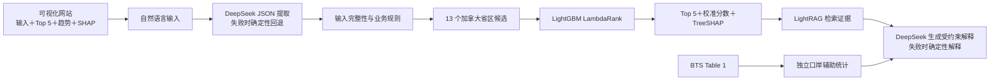

# 加拿大卡车跨境市场机会推荐系统

这是一个带可视化网站的市场机会推荐系统：从承运商的自然语言需求中提取美国起点州、HS2 商品、加拿大方向和计划月份，使用 LightGBM LambdaRank 对加拿大 10 个省和 3 个地区进行排序，返回 Top 5、机会分数、24 个月趋势、TreeSHAP 数值依据，以及由 LightRAG 检索证据约束的解释。

生产范围固定为“美国出口到加拿大、运输方式为卡车”。口岸数据只作为独立辅助统计，绝不表述成“州＋商品＋省＋口岸”的联合统计。

## 当前状态

- 数据下载、规范化、特征工程、时序切分、LambdaRank、校准、评估、SHAP、LightRAG、DeepSeek、CLI、FastAPI 和可视化网站链路均已实现。
- 自动化测试覆盖核心边界和防泄漏逻辑。
- 仓库中的 `SYNTHETIC_*` 文件仅用于功能冒烟测试，不可用于业务决策。
- 已导入并校验 2023-01 至 2026-05 的 41 个真实 BTS 月度 ZIP，生成真实主历史和独立口岸辅助 Parquet。
- 真实模型已完成严格时序训练与留出测试；NDCG@5 为 `0.9276`，高于历史规模基线 `0.9185`，通过既定主验收门槛。基线在 Precision@5、MAP@5 和 Spearman 上仍更高，详见模型卡，不能表述为所有指标全面胜出。
- DeepSeek 解析、LightRAG 检索、TreeSHAP 和 DeepSeek 受约束解释已使用真实模型完成端到端冒烟测试。

## 已确认的业务口径

| 项目 | 口径 |
|---|---|
| 输出目标 | 加拿大省/地区 Top 5 |
| 候选集 | 13 个已知加拿大省和地区；未知代码过滤 |
| 贸易方向 | 美国出口到加拿大 |
| 运输方式 | Truck |
| 主排序数据 | BTS current-format Table 2：州＋商品＋省 |
| 口岸辅助数据 | BTS Table 1：州＋省＋口岸，不含商品 |
| 连续标签 | `0.60 × 规模分位数 + 0.40 × 同比增长分位数` |
| 排序模型 | LightGBM `LGBMRanker` / LambdaRank |
| 大模型 | DeepSeek OpenAI-compatible API，默认 `deepseek-v4-flash`，可配置 |
| 前端 | React 19 + vinext + Recharts；通过同源代理连接 FastAPI |

车队规模会被解析和回传，但 BTS 没有足够字段支持它改变排序。HazMat 只在“货物明确要求危险品能力，且承运商明确表示没有能力”时判为非法；不会从 HS2 代码推断危险品属性。偏好口岸不会改变省级排序，只用于筛选或标注独立口岸辅助统计。

## 架构



DeepSeek 或 LightRAG 不可用时，服务会显式返回回退后端名称，不会声称调用成功。模型运行失败时也只会使用透明的历史信号回退，并在方法字段中暴露。

## 安装

需要 Python 3.11 或更高版本。

```bash
python -m venv .venv
source .venv/bin/activate
python -m pip install -e '.[rag,dev]'
```

不要把真实密钥写进 `.env` 或仓库。需要真实大模型调用时，在当前 shell 临时导出：

```bash
export DEEPSEEK_API_KEY='your-key'
export DEEPSEEK_MODEL='deepseek-v4-flash'
```

应用不自动读取 `.env`，并使用 Pydantic `SecretStr` 保存进程内配置。

## 数据准备

官方月度文件 URL 由下载器按下面的模式构造：

```text
https://www.bts.gov/sites/bts.dot.gov/files/transborder-raw/{year}/{Month}{year}.zip
```

自动下载与规范化：

```bash
crossborder download --start 2020-01 --end 2025-12
crossborder prepare \
  --input-dir data/raw \
  --history-output data/processed/table2_history.parquet \
  --ports-output data/processed/table1_ports.parquet
```

如果官方 CDN 返回 403，请从 BTS TransBorder Raw Data 页面手动下载同一批 ZIP，原样放入 `data/raw/`，再运行 `prepare`。规范化过程会硬过滤：

```text
COUNTRY = 1220  # Canada
TRDTYPE = 1     # Export
DISAGMOT = 5    # Truck
```

Table 2 生成省级训练历史；Table 1 生成不含商品维度的口岸辅助历史。两者不会做虚假的联合拼接。详细字段见 [数据契约](docs/data-contract.md)。

默认训练规范至少需要 32 个连续月份：12 个月特征历史、至少 2 个训练目标月、6 个验证月和 12 个测试月。程序不会因数据不足而自动缩短验证或测试窗口。

## 训练与评估

```bash
crossborder train \
  --history-path data/processed/table2_history.parquet \
  --port-history-path data/processed/table1_ports.parquet \
  --output artifacts/ranker.joblib
```

训练按月份严格划分训练集、验证集和测试集；类别编码器只在训练集拟合，验证集用于早停和等距回归校准，测试集只用于一次最终评估。输出包括：

- NDCG@1/3/5、Precision@5、Recall@5、F1@5、MAP@5、Top-1 accuracy、Spearman；
- 以查询组为单位的 bootstrap 95% 置信区间；
- 12 个月历史规模基线和近期增长基线；
- 校准 MAE/RMSE 和 Top-5 省区覆盖率。

上线验收门槛是：真实数据模型在留出测试期的 NDCG@5 必须高于历史规模基线。门槛结果会写入模型包；未通过时 API 会明确标注“仅供研发验证”。模型细节见 [模型卡](docs/model-card.md)。

仅验证代码链路时，可生成明确标记的合成数据：

```bash
crossborder make-demo-data --periods 60
crossborder train \
  --history-path data/processed/SYNTHETIC_history.parquet \
  --output artifacts/SYNTHETIC_ranker.joblib \
  --synthetic
```

## LightRAG 知识索引

知识文件位于 `knowledge/`，每条证据包含标题、摘录和来源 URL。DeepSeek 不提供本方案所需的 embedding 接口，因此本地使用 1024 维字符 n-gram hashing embedding 供 LightRAG 建索引；这是可复现的工程回退，不等同于语义 embedding 服务。

```bash
crossborder index-knowledge
```

未配置密钥或未建索引时，系统使用显式标记为 `lexical_fallback` 的本地检索。

## 使用

解析：

```bash
crossborder parse '我是Michigan的中型承运商，运输汽车零部件到加拿大，10月份有哪些市场？'
```

推荐：

```bash
MODEL_ARTIFACT_PATH=artifacts/ranker.joblib \
crossborder recommend '我是Michigan的中型承运商，运输汽车零部件到加拿大，10月份有哪些市场？'
```

启动 API：

```bash
crossborder serve --host 127.0.0.1 --port 8000
```

启动网站（另开一个终端）：

```bash
cd frontend
npm install
npm run dev
```

打开 `http://localhost:3000/`。网站通过服务器端同源代理访问
`http://127.0.0.1:8000`；如后端地址不同，在前端进程中设置
`RECOMMENDER_API_URL`。`DEEPSEEK_API_KEY` 只设置在 Python 后端进程，不能使用
`NEXT_PUBLIC_*` 变量或写入浏览器代码。

页面在提交需求后显示：DeepSeek 决策摘要、Top 5 排名、24 个月月度/3 月滚动/同比趋势、所选市场的 SHAP 正负贡献、独立口岸辅助图、证据与限制说明。趋势仅来自 Table 2，不含口岸；州＋商品无历史时会明确标记使用全美商品历史回退。

将网站发布到线上前，必须先提供可公开访问且受保护的 HTTPS FastAPI 地址，并配置访问控制和调用成本保护；线上前端无法访问本机 `127.0.0.1:8000`。

主要端点：

- `GET /health`
- `POST /v1/parse`，请求体 `{"query": "..."}`
- `POST /v1/recommend`，可传 `query` 或完整的 `structured`，二者只能选一个

若月份没有年份，系统会解析为数据截止月之后最近一次该月份，并在响应中返回 `resolved_planning_date` 和对应限制说明。

## 质量检查

```bash
ruff check src tests
pytest
cd frontend && npm test
```

## 目录

```text
src/crossborder_recommender/  主程序
frontend/                     可视化网站与 API 同源代理
data/reference/               HS2 商品目录
knowledge/                    LightRAG 证据文档
tests/                        自动化测试
docs/                         数据契约和模型卡
data/raw/                     BTS 原始 ZIP（不提交）
data/processed/               规范化 Parquet（不提交）
artifacts/                    模型和评估产物（不提交）
rag_storage/                  LightRAG 索引（不提交）
```

## 重要限制

- 推荐衡量历史市场机会，不代表实时运价、口岸排队时间、利润或收入保证。
- BTS 的加拿大省字段和口岸字段可能不是最终物理目的地或实际过境点。
- HS2 粒度较粗，不能支持零部件级别或 HazMat 合规推断。
- 证据解释只能复述排序信号和已检索资料，不能把外部资料伪装成模型特征。
- 只有真实 BTS 模型通过基线门槛后，才应进入生产候选。
