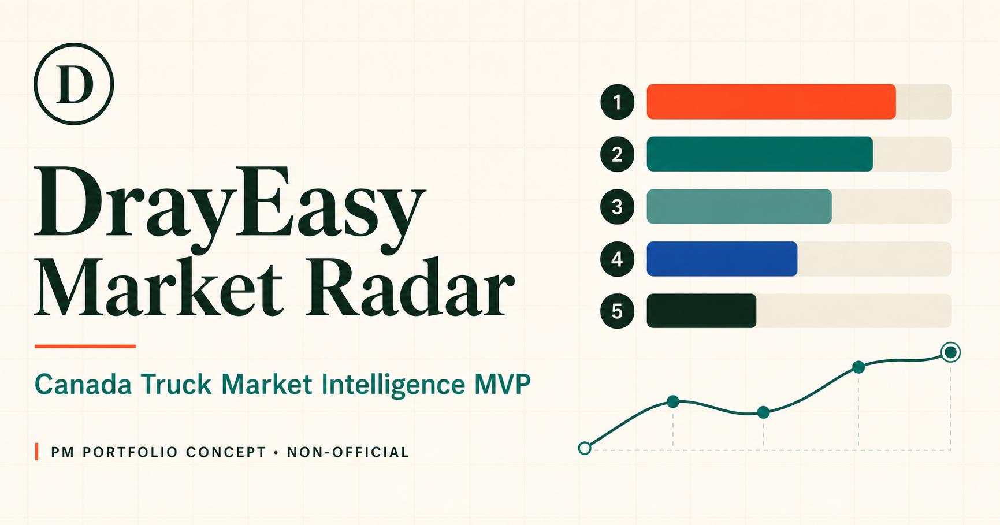
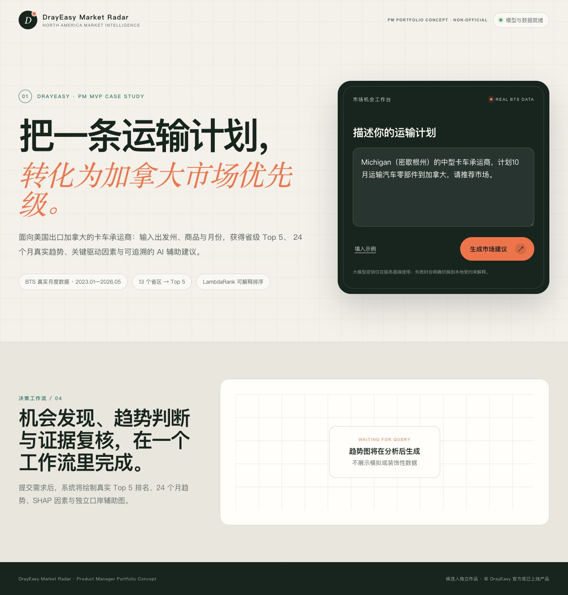
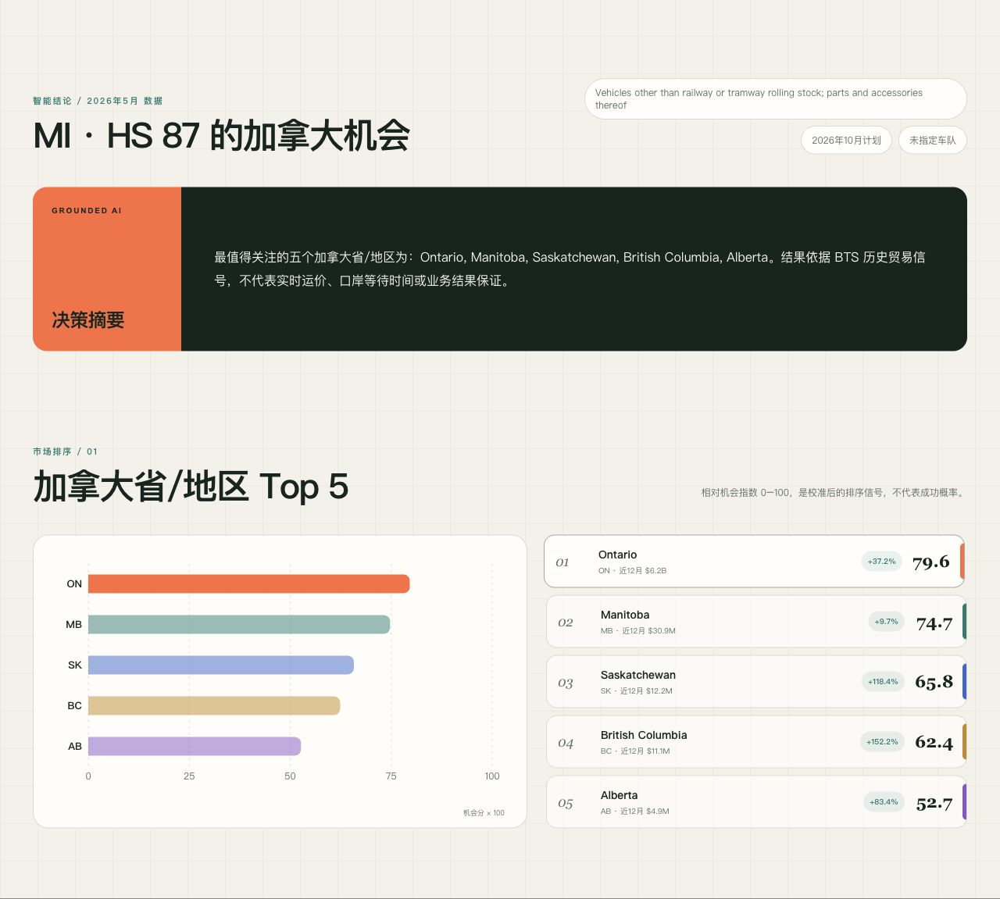
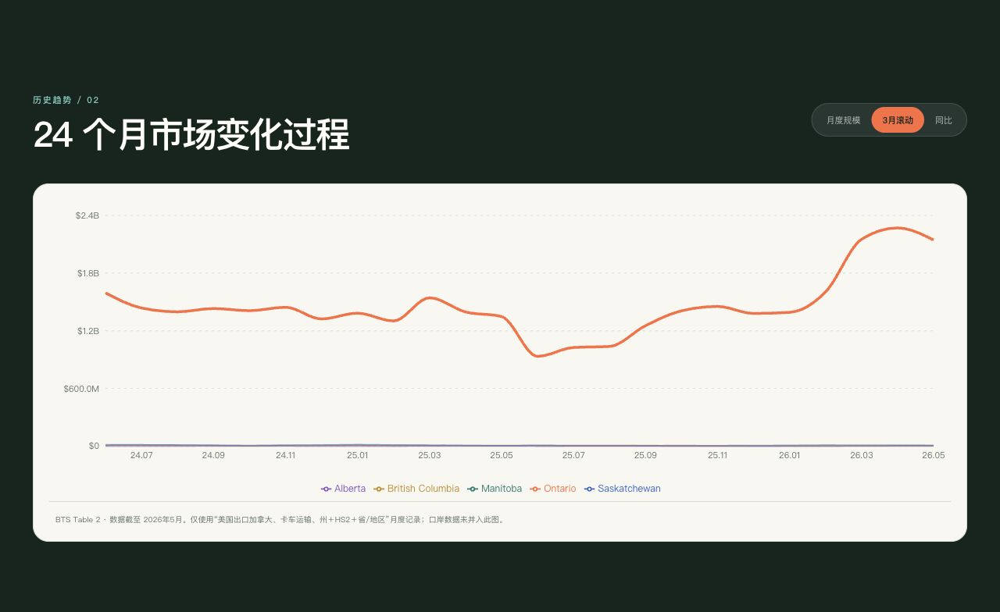
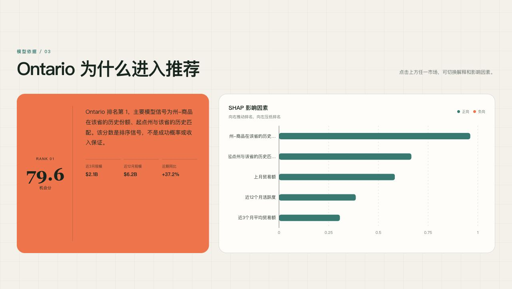
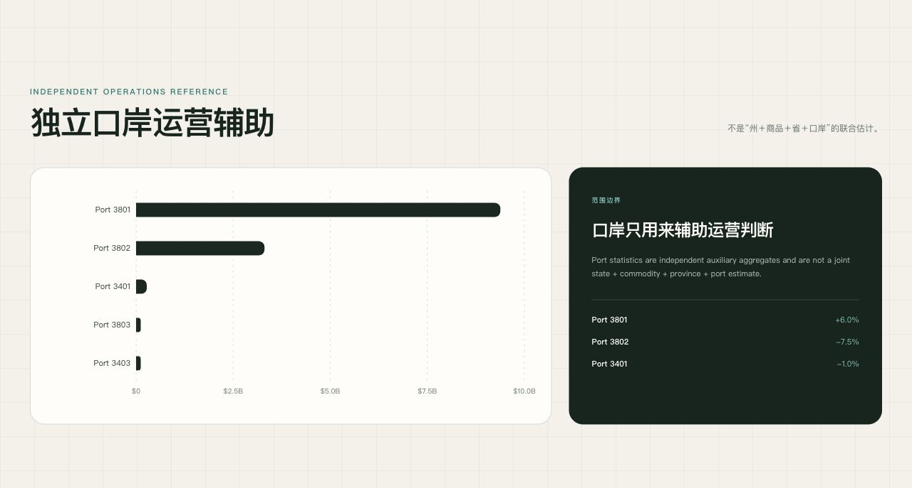
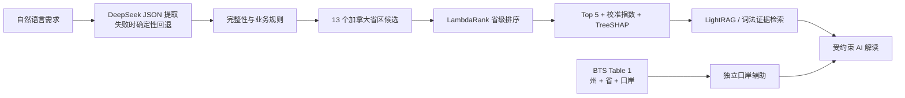
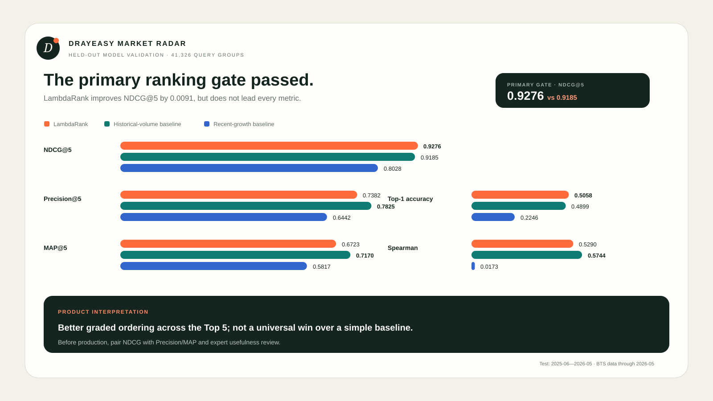
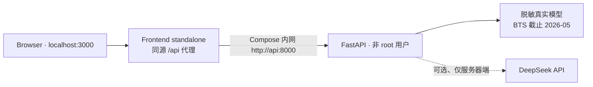

<p align="center">
  
</p>

<h1 align="center">DrayEasy Market Radar</h1>

<p align="center">
  <strong>把“下一步该验证哪个加拿大市场”，变成有趋势、有依据、有边界的 Top 5 决策清单。</strong>
</p>

<p align="center">
  Product Manager Internship Case Study · Canada Truck Market Opportunity Radar
</p>

<p align="center">
  
  
  
  
  
</p>

> [!IMPORTANT]
> 这是面向 DrayEasy 产品经理实习展示的独立候选人作品，使用公开 BTS 数据构建；不是 DrayEasy 官方产品，未使用公司内部数据，也不代表该方案已被公司采用。

<p align="center">
  <a href="#产品演示">产品演示</a> ·
  <a href="#关键产品决策">产品决策</a> ·
  <a href="#验证结果">验证结果</a> ·
  <a href="#docker-一键启动">Docker 一键启动</a>
</p>

---

## 30 秒看懂这个产品

| | 定义 |
|---|---|
| **目标用户** | 正在评估加拿大增量市场的跨境卡车承运商、Carrier Growth 与 Market Ops |
| **核心任务** | 从 13 个加拿大省/地区中，缩小值得继续查价、核验运力和开发客户的范围 |
| **输入** | 美国出发州、HS2 商品、加拿大方向、计划月份 |
| **输出** | 省级 Top 5、相对机会指数、24 个月趋势、TreeSHAP 驱动因素、证据和独立口岸辅助 |
| **产品价值假设** | 降低开放式市场研究成本，让市场筛选更一致、更可解释 |
| **明确非目标** | 实时运价、利润预测、接单保证、口岸等待时间或驾驶路线规划 |

| 41 个月真实数据 | 41,326 个留出测试查询组 | 13 → 5 市场筛选 | 主指标 NDCG@5 |
|:---:|:---:|:---:|:---:|
| **2023.01—2026.05** | **严格时序测试** | **加拿大省/地区** | **0.9276** |

## 产品问题

公开跨境贸易数据很多，但承运商真正需要的不是另一张原始数据表，而是一个可行动的问题答案：

> 当我评估一条新的北向业务机会时，针对我的起点州、货类和计划月份，哪些加拿大市场值得优先投入商务和运营资源继续验证？

这个 MVP 负责回答 **Where to explore**。它把市场发现放在查价、运力核验和客户开发之前，帮助用户形成候选清单；后续真实报价与履约能力仍需由业务系统和运营团队确认。


## 产品演示

### 1. 描述一条真实业务需求

用户不需要学习筛选器或统计字段，直接输入自然语言：

```text
Michigan（密歇根州）的中型卡车承运商，
计划 10 月运输汽车零部件到加拿大，请推荐市场。
```

<p align="center">
  
</p>

### 2. 获得可行动的 Top 5

系统解析为 `MI / HS 87 / Canada / October`，固定评估 13 个省区，再返回 Top 5 和受证据约束的摘要。下图来自当前真实模型运行，不是 UI 假数据。

<p align="center">
  
</p>

本次可复现结果（数据截止 **2026-05**，计划月份解析为 **2026-10**）：

| 排名 | 加拿大市场 | 相对机会指数 | 近 12 月历史规模 | 近期同比 |
|---:|---|---:|---:|---:|
| 1 | Ontario | 79.61 | $6.239B | +37.2% |
| 2 | Manitoba | 74.72 | $30.90M | +9.7% |
| 3 | Saskatchewan | 65.77 | $12.15M | +118.4% |
| 4 | British Columbia | 62.36 | $11.06M | +152.2% |
| 5 | Alberta | 52.68 | $4.85M | +83.4% |

> 相对机会指数是验证集校准后的排序信号，不是成功概率、报价或收入保证。本地截图未配置 API Key，因此如实显示 `GROUNDED AI` 确定性回退；配置 DeepSeek 后才会标注 `DEEPSEEK`。

### 3. 看见中间趋势，而不只接受一个答案

用户可以切换月度规模、3 月滚动规模和同比变化；默认突出当前选中的市场，其他市场保留为对照。

<p align="center">
  
</p>

### 4. 追问“为什么”，并检查统计边界

点击任一市场可查看 TreeSHAP 正负贡献。口岸图被放在独立运营辅助区，页面明确声明它不是“州＋商品＋省＋口岸”的联合估计。

<table>
  <tr>
    <td width="50%"></td>
    <td width="50%"></td>
  </tr>
  <tr>
    <td align="center"><sub>模型解释：哪些信号推高或压低排名</sub></td>
    <td align="center"><sub>运营辅助：口岸统计与省级推荐严格分开</sub></td>
  </tr>
</table>

### 60 秒演示路径

1. 点击「填入示例」，提交自然语言运输计划。
2. 核对系统解析出的州、HS2 商品和计划月份。
3. 查看省级 Top 5 与相对机会指数。
4. 切换「月度规模 / 3 月滚动 / 同比」查看 24 个月过程。
5. 点击 Ontario、Manitoba 等市场，比较 SHAP 与历史指标。
6. 查看独立口岸辅助及其非联合统计警告。
7. 打开证据与限制，确认建议没有被包装成实时价格或收益保证。

## 关键产品决策

| 产品决策 | MVP 选择 | 为什么这样取舍 |
|---|---|---|
| 地理与运输范围 | **美国出口加拿大、Truck** | 先形成数据口径清晰的闭环，不扩张到当前数据无法支持的场景 |
| 推荐对象 | **加拿大省/地区 Top 5** | BTS Table 2 支持州＋商品＋省，能够形成可验证的市场排序 |
| 训练标签 | **60% 规模分位＋40% 同比增长分位** | 在成熟市场规模与增长机会之间取得明确、可解释的平衡 |
| 排序方式 | **LightGBM LambdaRank** | 直接优化列表质量，而不是把机会问题误做成单点回归 |
| 口岸呈现 | **独立辅助统计** | Table 1 没有商品字段，不能伪造成四维联合统计 |
| 车队规模 | **解析并回传，但不参与排序** | 公共数据没有承运商车队规模特征，避免制造虚假个性化 |
| HazMat | **只执行显式能力规则** | HS2 粒度不足以推断危险品属性 |
| 大模型职责 | **解析与受约束解释，不参与排序** | 保证推荐结果来自可复现模型；调用失败时显式回退 |

其中最重要的产品判断不是“使用什么模型”，而是**拒绝把不同统计粒度的数据拼成看似更完整、实际上不可证明的联合推荐**。

## 方案如何工作



训练特征只使用目标月份之前的信息：1/3/6/12 月滚动规模、同比、趋势斜率、波动、州—省份额、商品—省份额、季节性和类别编码。训练、验证、测试按月份严格分开，编码器仅在训练集拟合。

## 验证结果

真实数据覆盖 2023-01 至 2026-05：省级主历史 **490,544 行**，独立口岸辅助 **136,188 行**。训练期为 2024-01 至 2024-11，验证期为 2024-12 至 2025-05，留出测试期为 2025-06 至 2026-05。

<p align="center">
  
</p>

| 方法 | NDCG@5 | Precision@5 | MAP@5 | Top-1 | Spearman |
|---|---:|---:|---:|---:|---:|
| **LambdaRank** | **0.9276** | 0.7382 | 0.6723 | **0.5058** | 0.5290 |
| 历史规模基线 | 0.9185 | **0.7825** | **0.7170** | 0.4899 | **0.5744** |
| 近期增长基线 | 0.8028 | 0.6442 | 0.5817 | 0.2246 | 0.0173 |

### 产品解读，而不是只报一个高分

- 预先设定的主指标 NDCG@5 比历史规模基线高 **0.0091**，两个 95% 区间不重叠，因此主验收门槛通过。
- 历史规模基线在 Precision@5、MAP@5 和 Spearman 上仍更好；证据只支持“模型更擅长 Top 5 的分级排序”，不支持“全面优于简单基线”。
- 进入生产前，应由业务方确认是否继续使用 NDCG 单门槛，或增加 Precision/MAP 与人工可操作性门槛。

可审计数据见 [evaluation-summary.json](docs/evaluation-summary.json)，完整实验设计见 [模型卡](docs/model-card.md)。

## 风险与使用边界

- BTS 贸易额是市场活跃度代理，不是订单量、可承运收入或利润。
- 数据按月发布且有延迟，不代表实时供需、报价或等待时间。
- 加拿大省字段不一定是最终物理目的地，口岸字段也不一定是实际驾驶过境点。
- HS2 粒度不足以支持 SKU、零部件或 HazMat 合规判断。
- 小市场和新市场历史稀疏，冷启动信号可信度更低。
- 推荐只形成“下一步验证清单”，不能替代报价、运力、合规和客户需求核验。

字段定义与统计口径见 [数据契约](docs/data-contract.md)。

## 产品路线图

### Now · MVP

- 自然语言输入 → Top 5 → 24 个月趋势 → SHAP → 证据 → 独立口岸辅助。
- 严格时序测试、后端密钥隔离与显式回退。

### Next · 业务验证

- 与 Carrier Success / Market Ops 共同盲审 20–30 个典型查询。
- 记录“有用 / 无用 / 原因 / 是否继续查价”，补上人工可操作性指标。
- 埋点完成率、time-to-shortlist、市场卡点击率和查价发起率。
- 将 NDCG、Precision/MAP 与专家判断组合成更稳健的上线门槛。

### Later · 数据闭环（获得授权后）

- 接入匿名化报价、承运接受率、容量、预订和履约结果。
- 建立“市场发现 → 查价 → 预订 → 结果反馈”闭环。
- 用 shadow test / A/B test 评估查价发起率和 booking conversion，而不是直接替代人工判断。

## Docker 一键启动

Docker 镜像内置的是**脱敏后的真实 BTS 模型**，全新克隆无需下载数据或重新训练，即可复现 README 中的真实 Top 5、趋势、SHAP 与口岸辅助结果。

```bash
git clone https://github.com/mayakid/north-america-truck-market-mvp.git
cd north-america-truck-market-mvp
docker compose up --build
```

等待 `frontend` 和 `api` 显示 healthy 后，打开 **http://localhost:3000**。

也可以使用带健康等待的一键脚本：

```bash
./scripts/docker-up.sh
```

停止服务：

```bash
docker compose down
```

### 可选：启用 DeepSeek

无 Key 时系统会明确使用本地受约束回退，所有排序、趋势和 SHAP 仍可正常运行。如需调用 DeepSeek：

```bash
cp .env.docker.example .env.docker
# 只在本机 .env.docker 中填写 DEEPSEEK_API_KEY
docker compose up --build
```

`.env.docker` 已被 Git 和 Docker 构建上下文排除；Key 只进入 Python API 容器，不会进入前端镜像或浏览器。空白 Key 会被视为“未配置”，不会触发无效外部调用。

### 容器边界



- 宿主机只开放 `127.0.0.1:3000`；FastAPI 只在 Compose 内网暴露。
- 两个服务都有健康检查，前端会等待真实模型 API 就绪后再启动。
- 前端使用 vinext production standalone 输出，运行镜像不携带完整开发依赖。
- 建议为 Docker Desktop 至少预留 1 GB 可用内存；API 固定单进程运行，避免模型被多 worker 重复加载。
- `ranker.joblib` 使用 joblib 序列化（具备 pickle 语义），只加载仓库内置或自行训练且来源可信的模型文件。
- 公开模型由 [export_public_artifact.py](scripts/export_public_artifact.py) 从本地真实模型导出；导出器会拒绝合成模型、未通过验收门槛的模型、本机用户路径和 Key-like 元数据。
- 当前公开模型 SHA-256：`c24419f057ea456551631781435f2c12194e89422a33f655bdaa0920ab4fbe20`。

## 手动开发运行

需要 Python 3.11+ 与 Node.js 22.13+。

```bash
python -m venv .venv
source .venv/bin/activate
python -m pip install -e '.[rag,dev]'
```

完整训练数据、测试预测和原始模型不提交。Docker 目录只保留一份路径脱敏的公开展示模型；如需自行训练，按 [数据契约](docs/data-contract.md) 下载 BTS 月度 ZIP 后：

```bash
crossborder prepare \
  --input-dir data/raw \
  --history-output data/processed/table2_history.parquet \
  --ports-output data/processed/table1_ports.parquet

crossborder train \
  --history-path data/processed/table2_history.parquet \
  --port-history-path data/processed/table1_ports.parquet \
  --output artifacts/ranker.joblib
```

启动后端和前端：

```bash
MODEL_ARTIFACT_PATH=artifacts/ranker.joblib \
crossborder serve --host 127.0.0.1 --port 8000

cd frontend
npm install
npm run dev
```

打开 `http://localhost:3000/`。如需 DeepSeek，在**后端进程**临时设置 `DEEPSEEK_API_KEY`；不要使用 `NEXT_PUBLIC_*`，也不要把真实密钥写进 `.env` 或仓库。未配置时，页面会明确显示确定性回退，不会假装调用成功。

```bash
ruff check src tests
pytest
cd frontend && npm test
```

## 工程结构

```text
src/crossborder_recommender/  数据处理、特征、排序、解释、CLI 与 API
frontend/                     React 19 + vinext + Recharts 可视化网站
compose.yaml                  前后端编排、依赖顺序与健康检查
docker/model/                 脱敏后的真实 Docker 展示模型
docs/assets/                  真实产品截图与留出测试图
docs/                         数据契约、模型卡、可审计评估摘要
knowledge/                    LightRAG 约束证据
tests/                        边界、防泄漏与 API 自动化测试
data/raw/                     BTS 原始 ZIP（不提交）
data/processed/               规范化 Parquet（不提交）
artifacts/                    本地训练模型和预测产物（不提交）
```

---

<p align="center">
  <strong>DrayEasy Market Radar</strong><br />
  <sub>Product thinking × data rigor × explainable AI</sub>
</p>
